# Sysgen NETSOL Screens

This repository contains a varied selection of NETSOL screens for use with MVS 3.8j.

Most of these were generated with https://github.com/mainframed/ANSi2EBCDiC

The `images` folder contains examples of the netsol screens, the `ans` folder contains the original ANSI used to generate these screens. This ANSI was created with Moebius and authors are credited for the original artwork within the JCL.

**Note**: The screenshots below were taken with x3270. If the colors don't look the same in your tn3270 emulator of choice you can rebuild the NETSOL screen by looking at the line 16 in the JCL file and rerunning ANSi2EBCDiC with the same commands minus the `--extended` flag. For example in `EIGHTIES.JCL` it has:

```
//* Command Line Args: --sysgen eighties.ans --ROW 23 --COL 9 --member
//*                    EIGHTIES --file EIGHTIES.JCL --extended
```

So i would rebuild it with: `/path/to/ANSi2EBCDiC/ansi2ebcdic.py --sysgen ans/eighties.ans --ROW 23 --COL 9 --member EIGHTIES --file EIGHTIES.JCL`

## Install

Submit any of the JCL files to your MVS 3.8j sysgen mainframe either using the local port or by uploading it and submitting it in TSO.

The JCL copies the netsol source from `SYS1.AMACLIB(NETSOL)`, places it in `SYS1.UMODMAC(NETSOL)` and updates as appropriate. The 3270 stream is then placed it in own member in `SYS1.UMODMAC`.

After submitting the job you need to reset VTAM with:

```
/p tso
/z net,quick
/s net
```

## Screenshots

### CORPORAT

**CORPORAT.JCL**

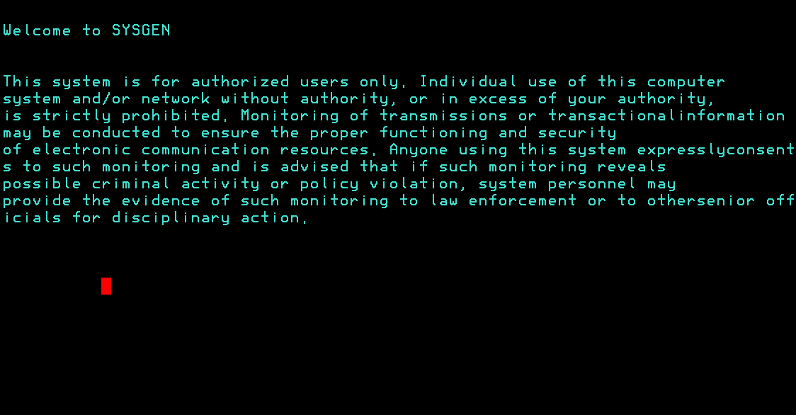

### DOCKER

**DOCKER.JCL**

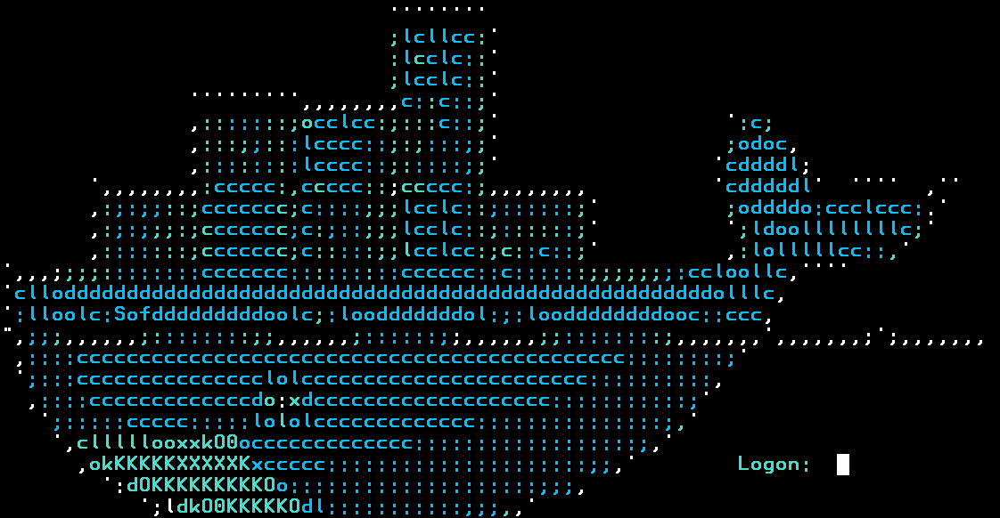

### EIGHTIES

**EIGHTIES.JCL**

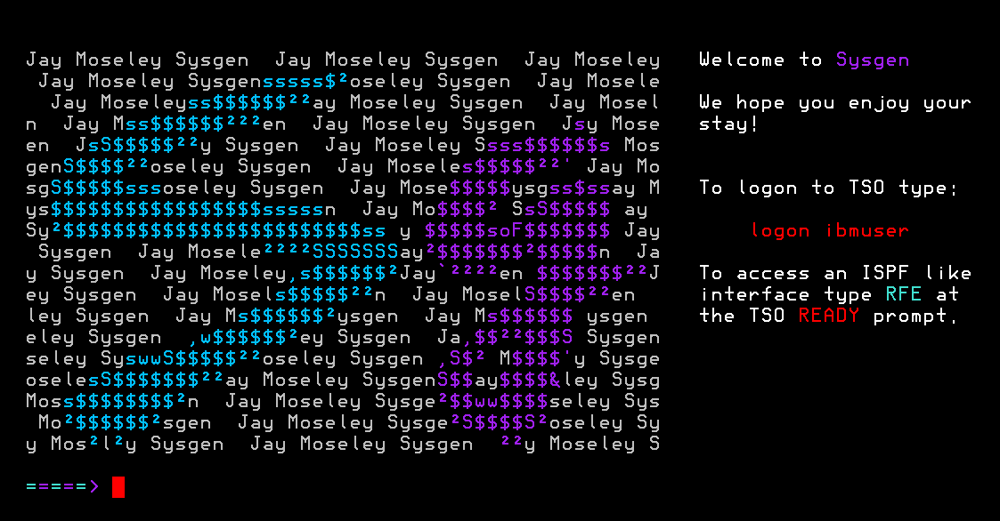

### ENTROPY

**ENTROPY.JCL**

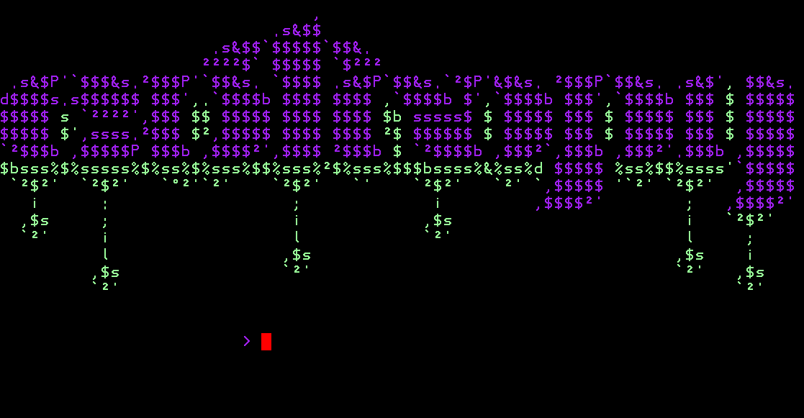

### FEDERAL

**FEDERAL.JCL**

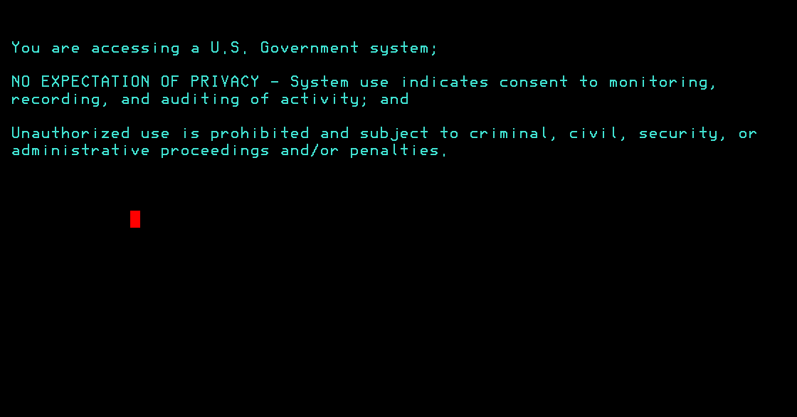

### GODZILLA

**GODZILLA.JCL**

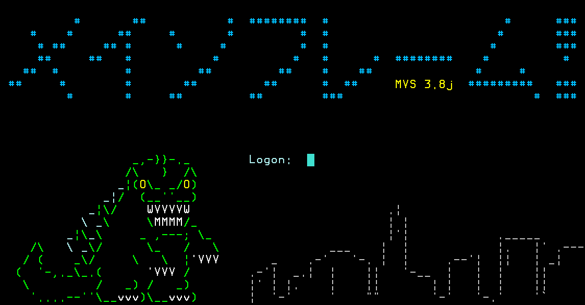

### MFRAME

**MFRAME.JCL**

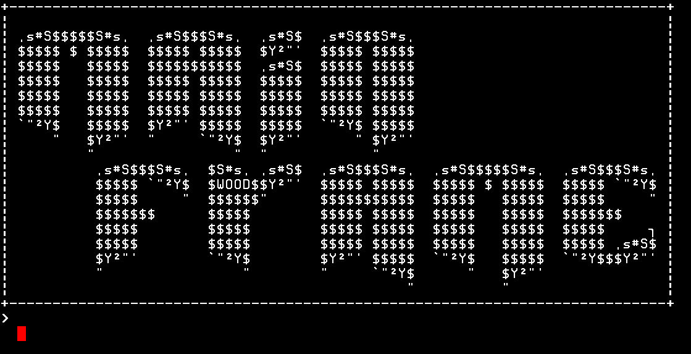

### MOSELEY

**MOSELEY.JCL**

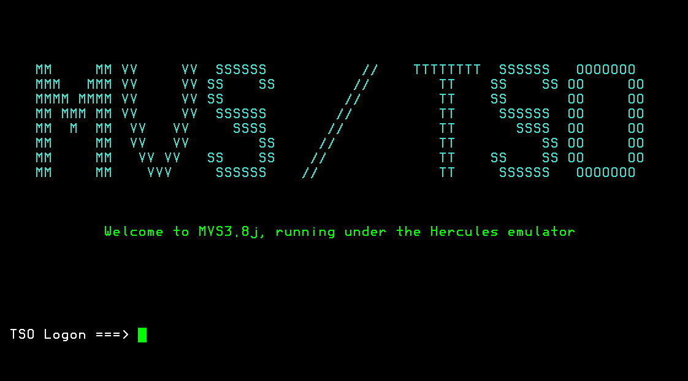

### SKULL

**SKULL.JCL**

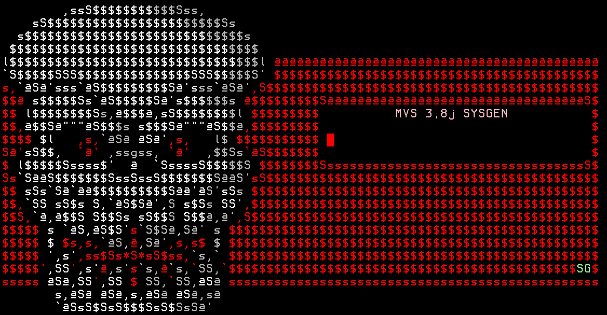

### TOMMY

**TOMMY.JCL**

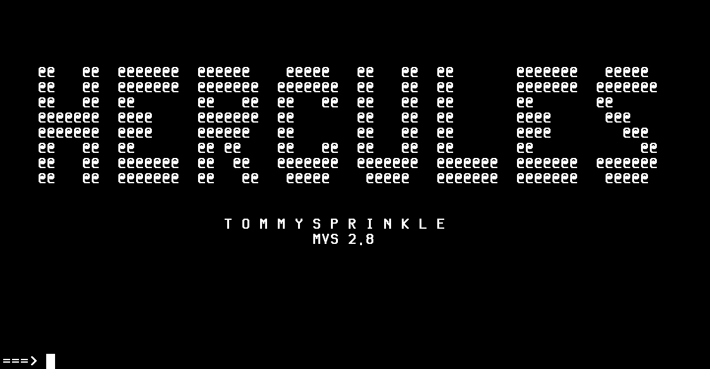

### WELCOME

**WELCOME.JCL**

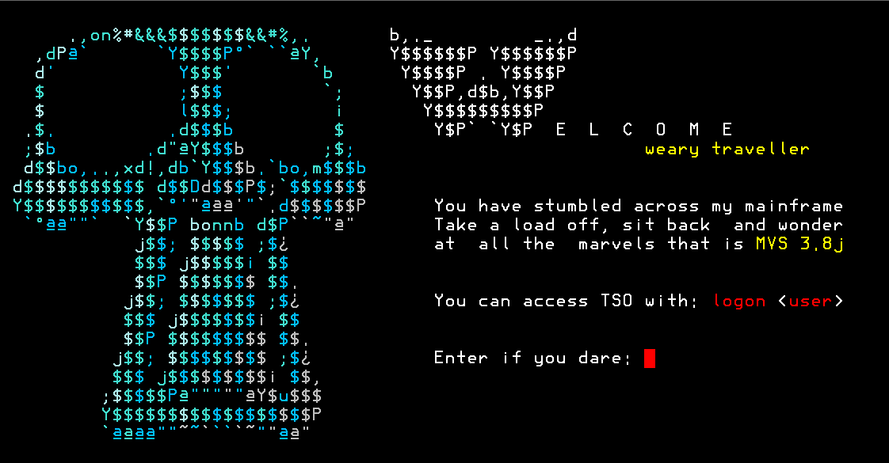